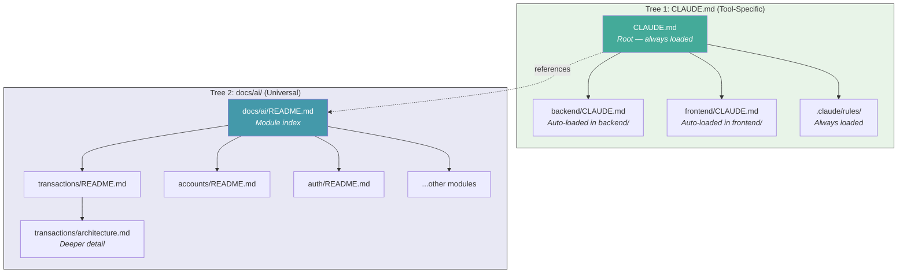
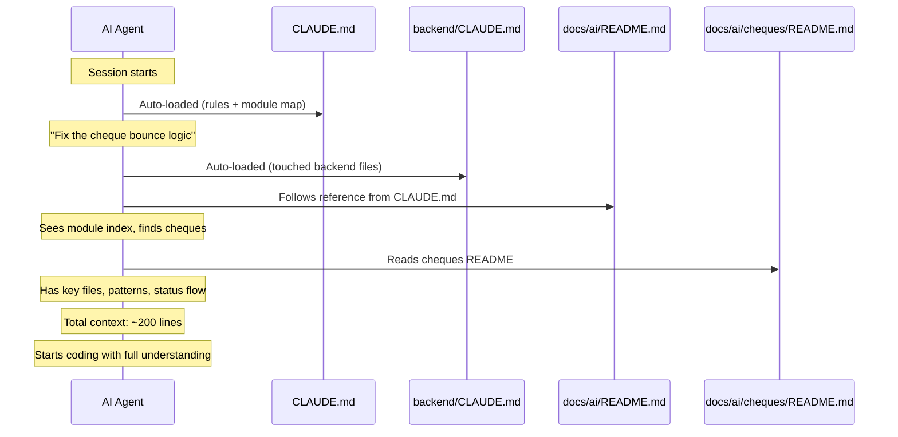
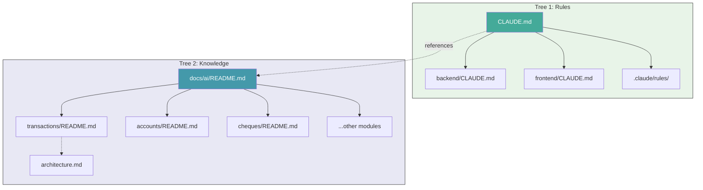
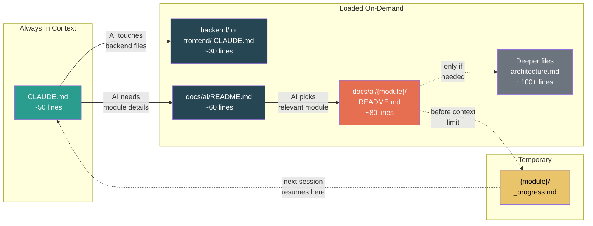

# Recursive Context Tree: A Pattern for AI-Assisted Development

**The problem:** AI coding agents (Claude Code, Cursor, Copilot, etc.) have a fixed context window. They can't remember previous sessions. Every time you start a new conversation, the AI knows nothing about your project.

**The common mistake:** Developers dump massive documentation into the context — architecture reports, changelogs, implementation histories. This wastes tokens on information the AI doesn't need for the current task, and the important details get lost in noise.

**The solution:** A recursive knowledge tree that loads context on-demand, one level at a time.

---

## The Core Idea

Think of your project knowledge like a file system. You don't load every file on your computer into RAM — you open what you need. AI context should work the same way.

```
Level 0: Project overview         ← ALWAYS loaded (~50 lines)
Level 1: Module summaries         ← Loaded when working on that module (~80 lines)
Level 2: Deep architecture docs   ← Loaded only when needed (~100+ lines)
Level 3: Specific implementation  ← Rarely needed
```

At any point, the AI has maybe 130-200 lines of context loaded — not 10,000. That's 2% of its context window instead of 40%.

---

## Two Trees, Two Purposes

The pattern uses **two separate recursive trees** that work together:



### Tree 1: CLAUDE.md — Lives in your code folders

- **Purpose:** Rules, conventions, commands — things the AI must follow
- **How it loads:** Automatically by Claude Code based on which directory you're working in
- **Who uses it:** Claude Code specifically (other tools have their own format)
- **Contains:** "How to work here" — short, imperative rules

### Tree 2: docs/ai/ — Lives in a dedicated folder

- **Purpose:** Deep knowledge — architecture, key files, patterns, API docs
- **How it loads:** On-demand — the AI navigates to the module it needs
- **Who uses it:** ANY AI tool, ANY LLM (universal, tool-agnostic)
- **Contains:** "How this works" — descriptive, feature-based documentation

### How They Connect



**Tree 1 tells the AI how to behave.** Tree 2 tells the AI how the code works. The root CLAUDE.md bridges them with a reference to docs/ai/.

---

## The Full Structure

### Tree 1: Rules (tool-specific, auto-loaded)

| File | Loading | Purpose |
|------|---------|---------|
| `CLAUDE.md` | Always | Project rules, module map, stack |
| `backend/CLAUDE.md` | When touching backend/ | Backend commands, conventions |
| `frontend/CLAUDE.md` | When touching frontend/ | Frontend commands, patterns |
| `.claude/rules/doc-maintenance.md` | Always | Doc update rules |

### Tree 2: Knowledge (universal, on-demand)

| File | Loading | Purpose |
|------|---------|---------|
| `docs/ai/README.md` | On-demand | Module index + API overview |
| `docs/ai/{module}/README.md` | On-demand | Key files, patterns, current state |
| `docs/ai/{module}/architecture.md` | Rarely | Deep architecture (if README isn't enough) |
| `docs/ai/{module}/_progress.md` | Optional | Temporary progress from interrupted work (delete when done) |



### Why Two Trees?

| | Tree 1 (CLAUDE.md) | Tree 2 (docs/ai/) |
|---|---|---|
| **Contains** | Rules, commands, conventions | Knowledge, architecture, key files |
| **Loading** | Automatic (tool-native) | On-demand (AI navigates) |
| **Scope** | Per-directory (backend/, frontend/) | Per-feature (transactions, auth) |
| **Audience** | One specific tool (Claude Code) | Any AI tool, any LLM |
| **Size** | ~30-50 lines each | ~70-120 lines each |
| **Updates** | Rarely (conventions don't change often) | After every feature (current state) |

You can use only Tree 2 if you don't use Claude Code. Or only Tree 1 if your project is small. Together, they cover both "how to behave" and "how things work."

---

## Layer 1: CLAUDE.md (The Root)

This file is auto-loaded by Claude Code every session. Keep it under 60 lines.

```markdown
# My Project

Brief description of what this project does.

## Stack
- Backend: Django, PostgreSQL
- Frontend: React, TypeScript

## Module Map
(simple ASCII diagram showing how modules connect)

## Rules
- Business logic goes in services.py, not views
- API calls defined in lib/api.ts
- (3-5 critical rules the AI must never break)

## Deep Context (Recursive Hierarchy)
This project uses a recursive docs tree in `docs/ai/`.
Navigate on-demand — don't load everything:
- `docs/ai/README.md` → module index
- `docs/ai/{module}/README.md` → deep context per module
- Each README links to related modules — follow as needed

## Doc Maintenance (REQUIRED)
After completing ANY feature, update `docs/ai/{module}/README.md`.
```

**What goes here:** Rules, conventions, stack, module map.
**What doesn't:** Implementation details, API docs, architecture decisions.

---

## Layer 2: docs/ai/README.md (The Index)

This is the universal entry point. Any AI tool — not just Claude — can be pointed here.

```markdown
# Project — AI Context

## Module Map
(same diagram as CLAUDE.md, or more detailed)

## Modules
| Module | What it does | Docs |
|--------|-------------|------|
| [auth](./auth/) | JWT authentication, RBAC | System-level |
| [products](./products/) | Product catalog, variants | Core feature |
| [orders](./orders/) | Order processing, payments | Core feature |

## API Overview
| Prefix | Module | Key Endpoints |
|--------|--------|---------------|
| /api/auth/ | Auth | login, refresh, me |
| /api/products/ | Products | CRUD + search |
| /api/orders/ | Orders | CRUD + checkout |
```

---

## Layer 3: Module READMEs (The Deep Context)

Each module gets one README that contains **everything an AI needs to work on that module**. This is the key file — it must be good.

### The Template

Every module README follows the same format:

```markdown
# Module Name

> One-line description of what this module does.
> Last verified: YYYY-MM-DD

## Current State
- What exists right now (3-5 bullets)
- What works, what doesn't

## Key Files

### Backend
| File | Purpose |
|------|---------|
| `backend/module/models.py` | Models and relationships |
| `backend/module/services.py` | Business logic |
| `backend/module/views.py` | API endpoints |

### Frontend
| File | Purpose |
|------|---------|
| `frontend/src/components/module/MainComponent.tsx` | Primary UI |
| `frontend/src/hooks/useModule.ts` | Data fetching hooks |

## How It Works
(Brief explanation of the main flow — 5-10 lines max)

## Critical Patterns
- Things the AI MUST know to not break things
- "Never do X directly, always go through Y"
- "This field is read-only, updated by Z"

## Related Modules
- [other-module](../other-module/) — how they connect
```

### The Golden Rules

1. **Write "what IS" not "what was done"**
   - Bad: "On Jan 15 we migrated from REST to GraphQL"
   - Good: "Uses GraphQL. All queries defined in schema.graphql"

2. **Feature-based, not layer-based**
   - Bad: separate backend/ and frontend/ folders
   - Good: one README per feature with both backend AND frontend info
   - Why: When fixing "the checkout flow", the AI needs both the API endpoint and the React component together

3. **Keep each README short — 120 lines is a good benchmark**
   - The exact number matters less than the discipline. Pick a limit, stick to it.
   - If you need more, link to a deeper file (architecture.md, known_issues.md)
   - The AI will follow the link only if it needs to

4. **Key files table is the most important section**
   - The AI's first question is always "which files do I need to read?"
   - Give it the answer upfront

---

## The Session Checkpoint Pattern (Optional)

Most AI tools already handle context limits automatically — Claude Code compresses earlier messages, Cursor manages context internally. **You don't need checkpoints for basic continuity.**

But automatic compression loses nuance. It keeps the gist but drops specific decisions, trade-off reasoning, and "why we chose X over Y." When that matters, save it manually:

```markdown
<!-- docs/ai/payments/_progress.md -->
# Progress: Checkout Refactor

## Status: IN PROGRESS

## What Was Done
- Refactored PaymentService to use strategy pattern
- Added Stripe provider, removed legacy PayPal code

## What's Left
- Add webhook handler for Stripe events
- Update frontend CheckoutForm to use new API

## Key Decisions
- Using strategy pattern (not if/else) for payment providers
- Webhook verification via Stripe SDK, not manual

## Files Modified
- backend/payments/services.py — new PaymentStrategy base class
- backend/payments/providers/stripe.py — new file
```

Next session, the AI navigates to the module folder and finds `_progress.md` alongside the README automatically.

Delete `_progress.md` when the task is done. It's temporary — not part of the permanent docs tree.

**When to use checkpoints:**
- Multi-session refactors with specific architectural decisions
- Tasks where "why" matters as much as "what" (and you don't want compression to lose it)
- Handing off mid-task to a different AI tool or team member

**When to skip them:**
- Simple features that finish in one session
- Tasks where the AI's built-in compression is good enough
- Anything where the module README already captures the relevant state

### The Full Lifecycle: Progress → Module README

Progress files and module READMEs live in the same folder:

```
docs/ai/payments/
  ├── README.md        ← permanent state ("what IS")
  └── _progress.md     ← temporary ("what I'm doing") — delete when done
```

```
Session 1: Start feature
  → Work in progress, not finished
  → Save to docs/ai/payments/_progress.md

Session 2: Resume
  → AI navigates to module folder, sees _progress.md next to README
  → Continues work, finishes feature
  → Deletes _progress.md
  → Updates docs/ai/payments/README.md with current state
```

Keeping the progress file in the module folder means the AI finds it naturally — no separate folder to manage.

Add this to your maintenance rule so the AI knows the workflow:
```markdown
If work spans multiple sessions:
1. Save progress to docs/ai/{module}/_progress.md
2. Next session: check for _progress.md alongside the README
3. When done: delete _progress.md, update module README
```

---

## Keeping Docs Fresh

The biggest risk is docs going stale. There's no magic solution — but you can make it significantly easier.

### The Maintenance Rule

Create `.claude/rules/doc-maintenance.md`:

```markdown
## Doc Maintenance Rule

IMPORTANT: After completing any feature, bug fix, or significant change, you MUST:

1. Check if `docs/ai/{module}/README.md` exists for the module you modified
2. If it exists: update it to reflect the CURRENT state
3. If it doesn't exist: create it following the same format
4. Keep each README under 120 lines

Format rule: write "what IS" not "what was done".
This is not optional. Treat doc updates as part of task completion.
```

### How well does this actually work?

**The AI drafts, you approve.** The maintenance rule causes the AI to update docs after most features — but the output needs human review. Common failure modes:

- **Verbosity creep** — the AI adds bullets but never removes them. Files slowly grow past 120 lines.
- **Dropped patterns** — the AI doesn't recognize which patterns are critical and quietly omits them during rewrites.
- **Surface-level updates** — the AI updates "Current State" but misses that a key file was renamed or a flow changed.

**What works in practice:**
1. The rule gets the AI to *attempt* doc updates ~80% of the time — without it, the rate is near zero
2. Saying "update the docs" in the remaining 20% works immediately — the AI knows the format and where to write
3. The `Last verified:` date in each README tells you at a glance what might be stale
4. Periodic human review (every few weeks) catches the drift that the AI introduces

This isn't fully automated documentation. It's AI-assisted documentation with a human in the loop. That's still dramatically better than manually maintaining docs, which in practice means not maintaining them at all.

---

## Cross-Tool Compatibility

Different AI tools have different auto-loading conventions:

| Tool | Auto-loads | Format |
|------|-----------|--------|
| Claude Code | `CLAUDE.md` at project root + subdirectories | Markdown |
| Cursor | `.cursor/rules/*.mdc` | Markdown with frontmatter |
| Windsurf | `.windsurf/rules/rules.md` | Markdown |
| GitHub Copilot | `.github/copilot-instructions.md` | Markdown |

**Don't create files for every tool.** Instead:

1. Put your core knowledge in `docs/ai/` (works with everything)
2. Use `CLAUDE.md` for your primary tool
3. If you switch tools, just copy the CLAUDE.md content to that tool's format

The `docs/ai/` folder is tool-agnostic. Any AI can be told "read docs/ai/README.md" and navigate from there. That's the universal layer.

---

## How Much Context Does This Actually Use?

Real numbers from a production accounting platform with 9 modules:

| Approach | Total docs | Per-task context loaded | How it finds what it needs |
|----------|-----------|----------------------|---------------------------|
| Flat reports folder | 142 files, 81K lines | ~500-1000 lines (AI searches, reads 3-5 files) | AI grep/search through unstructured reports |
| **Recursive tree** | 12 files, ~750 lines | **~214 lines** (1 root + 1 module README) | Structured index → direct navigation |

Both approaches load context on-demand — neither dumps everything. The difference:

- **Flat reports:** The AI spends turns searching, opening wrong files, reading verbose reports to extract the 10 lines it actually needs. The signal is buried in narrative.
- **Recursive tree:** The AI reads one ~75-line README that's already structured as a reference — key files, patterns, current state. No searching, no filtering noise.

The win isn't just fewer tokens — it's fewer wasted turns and higher signal density per line loaded.

---

## Quick Start (Copy This)

1. Create `CLAUDE.md` at your project root (or equivalent for your tool)
2. Create `docs/ai/README.md` with your module index
3. For each major module, create `docs/ai/{module}/README.md`
4. Add the doc-maintenance rule so docs stay fresh
5. Tell your AI: "Read CLAUDE.md first" — or let it auto-load

Start small. You don't need every module documented on day one. Document the module you're about to work on, and grow the tree organically.

### Bootstrapping Your First Module README

You can ask your AI to generate a starting draft. Paste this prompt:

```
Read the code in backend/{module}/ and frontend/src/components/{module}/.
Generate a docs/ai/{module}/README.md following this format:
- One-line description + "Last verified: today's date"
- Current State (3-5 bullets)
- Key Files table (backend AND frontend)
- How It Works (5-10 lines)
- Critical Patterns (things that would break if ignored)
- Related Modules (with links)
Keep it under 120 lines. Write "what IS" not "what was done."
```

**Important caveat:** This produces a *starting draft*, not a finished doc. The AI will get the file lists right but will likely miss subtle patterns, critical invariants, and non-obvious relationships. Plan to spend 10-15 minutes editing the output before trusting it. A mediocre README that you've reviewed is far better than a polished one that's subtly wrong.

---

## Summary

| Principle | Why |
|-----------|-----|
| Recursive, not flat | Load only what you need — save context for code |
| Feature-based, not layer-based | AI needs both frontend and backend together |
| "What IS" not "what was done" | History is noise — current state is signal |
| Keep files short (~120 lines) | If it's longer, split into deeper files |
| AI-drafted, human-approved | Doc-maintenance rule + periodic review |
| One universal folder (docs/ai/) | Works with any AI tool, any LLM |
| Session checkpoints | Save state before context limit, resume later |

### The Complete Flow



The AI doesn't need to understand your whole project. It needs to understand the part it's about to touch, in the fewest tokens possible.
